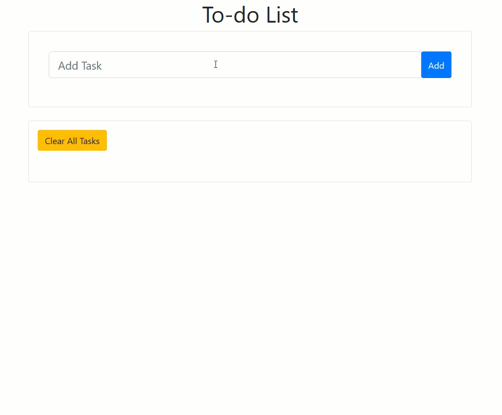

# Project Name
node-express-redis-simple-todolist

# How to use
```
git clone https://github.com/supanniga/node-express-redis-simple-todolist.git
cd node-express-redis-simple-todolist
npm install
npm start
```
open http://localhost:3000/

# Demo

